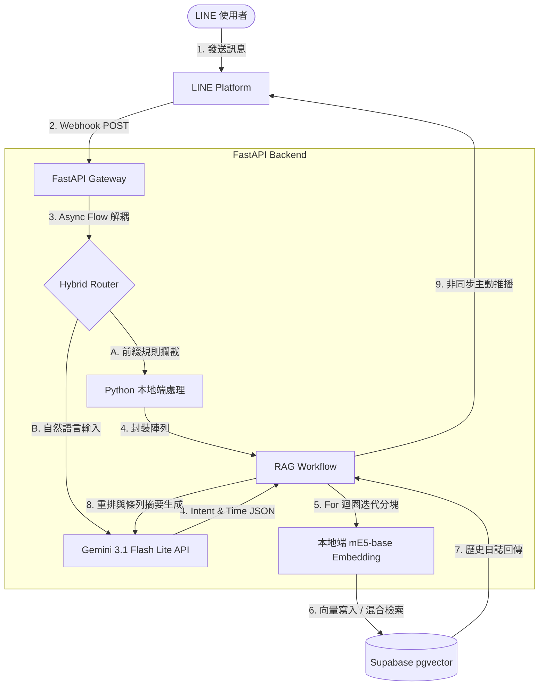

# 🤖 Time-Aware Smart Work-Log RAG System
> 專為個人工作日誌設計的智慧檢索與摘要系統，整合 LLM 意圖解析、語意分塊與非同步架構，解決真實 RAG 系統落地的常見痛點。

[](https://huggingface.co/spaces/q9jotaro/W_Log)
[](https://fastapi.tiangolo.com/)
[](https://supabase.com/)

## 🚀 系統架構 (Architecture)

本系統部署於 Hugging Face Spaces，透過 FastAPI 接收 LINE Webhook，並採用非同步工作流進行 RAG 檢索與生成。



---

## 🛠️ 技術棧 (Tech Stack)

- **Backend:** Python 3.10, FastAPI
- **LLM Engine:** `Gemini 3.1 Flash Lite` (Structured Outputs / JSON Schema)
- **Vector Database:** Supabase (pgvector)
- **Embedding Model:** `intfloat/multilingual-e5-base` (本地化運行)
- **Deployment & CI/CD:** Docker, GitHub Actions, Hugging Face Spaces

---

## 💡 核心工程優化 (Engineering Highlights)

### 1. 非同步架耦 (Async Background Tasks)
為解決 LINE Webhook 嚴格的 **4.75 秒** 應答限制，系統採用 FastAPI `BackgroundTasks` 機制。在接收請求的 0.1 秒內立即回傳 HTTP 200，將耗時的「意圖解析 ➡️ 向量計算 ➡️ 資料庫檢索 ➡️ LLM 生成」移至背景處理，達成 **0% 逾時失敗率**。

### 2. 多重事件自動拆分 (Pre-chunking Strategy)
當使用者輸入複合事件（如：「早上研究架構優化，下午請假」）時，系統透過 LLM 解析為結構化 JSON 陣列，後端以迴圈為每個獨立事件單獨生成 Embedding。這徹底消除語意稀釋，提升檢索精準度。

### 3. 規則與語意混合路由 (Hybrid Router)
設計混合路由機制，優先攔截帶有指令符號（如 `log`, `?`）的輸入。針對明確指令直接於本地端處理，跳過不必要的 LLM 意圖分析階段，有效節省約 **50% 的 API 成本**。

---

## 📦 本地端開發指南 (Setup)

### 1. 環境變數設定
於專案根目錄建立 `.env` 檔案並填入金鑰：

```env
LINE_CHANNEL_ACCESS_TOKEN=your_token
LINE_CHANNEL_SECRET=your_secret
GEMINI_API_KEY=your_key
SUPABASE_URL=your_url
SUPABASE_KEY=your_key
```
### 2. 啟動服務
```bash
pip install -r requirements.txt
uvicorn main:app --host 0.0.0.0 --port 7860 --reload
```

### 3. 資料庫初始化 (Supabase SQL)
執行以下指令建立向量資料表與索引：

```sql
CREATE EXTENSION IF NOT EXISTS vector;

CREATE TABLE work_logs (
  id BIGSERIAL PRIMARY KEY,
  user_id TEXT NOT NULL,
  content TEXT NOT NULL,
  embedding VECTOR(768),
  event_time TIMESTAMPTZ DEFAULT NOW(),
  created_at TIMESTAMPTZ DEFAULT NOW()
);

-- 建立 HNSW 索引加速向量檢索
CREATE INDEX ON work_logs USING hnsw (embedding vector_cosine_ops);

-- 賦予連線角色寫入與查詢權限
GRANT SELECT, INSERT ON public.work_logs TO anon, authenticated, service_role;
GRANT USAGE, SELECT ON ALL SEQUENCES IN SCHEMA public TO anon, authenticated, service_role;
```