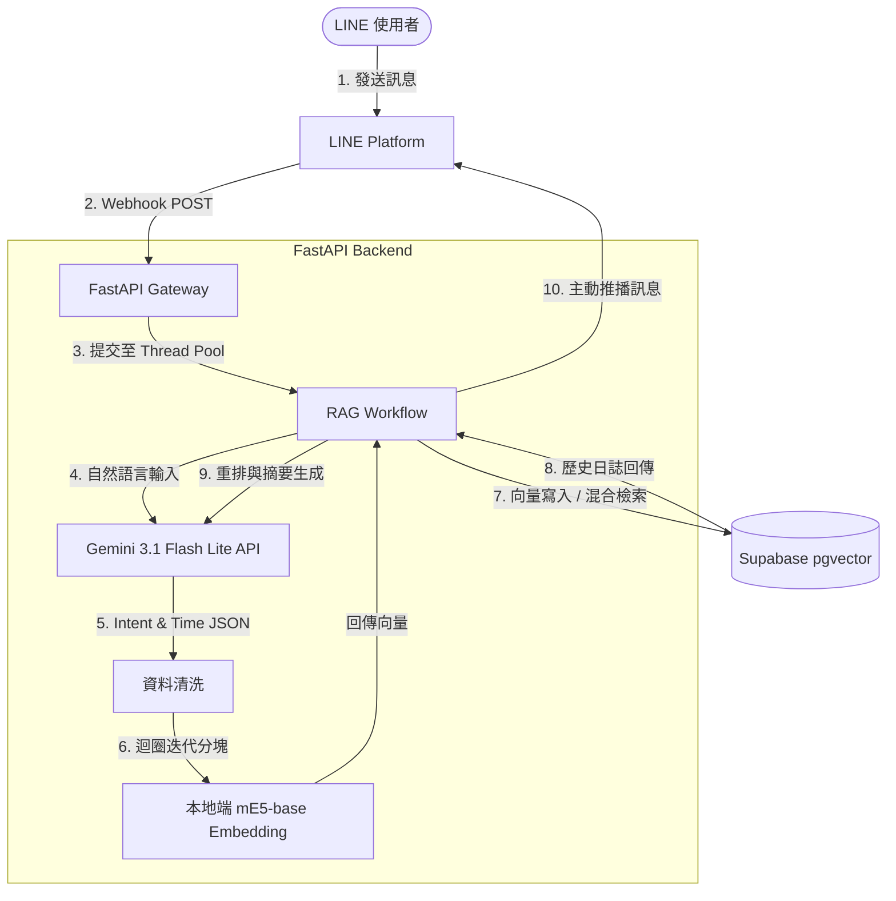

# 🤖 Time-Aware Smart Work-Log RAG System

> **個人工作日誌的 RAG 智慧解方：解決生產環境下的異步挑戰與語意精準度**  
> 本專案提供端到端的智慧工作管理體驗：
> - **語意化記錄**：隨手輸入工作內容，系統自動解析時間、拆分事件並向量化儲存。
> - **精確溯源查詢**：不僅能回顧每日事項，更支援跨時間維度的快速檢索。例如詢問：*「我上週什麼時候對 AAA 功能做了調整？」*，系統將精確從數月紀錄中回顧特定功能的變更軌跡，大幅節省複盤與填寫週報的時間。

[](https://huggingface.co/spaces/q9jotaro/W_Log)
[](https://fastapi.tiangolo.com/)
[](https://deepmind.google/technologies/gemini/)
[](https://supabase.com/)

---

## 🎯 專案亮點 (Core Value)

在開發基於 LINE Bot 的 RAG 系統時，常面臨 **Webhook 應答逾時 (4.75s)** 與 **語意稀釋 (Semantic Dilution)** 的挑戰。本專案透過以下工程實踐解決問題：

1.  **背景執行緒解耦 (Thread Pool Decoupling)**: 採用執行緒池處理耗時的 RAG 同步流程，達成 100% 成功應答率並解決 LINE 單次應答限制。
2.  **精準預分塊策略 (Pre-chunking Logic)**: 利用 LLM 結構化輸出功能，在 ingestion 階段即實現「按工作事件拆分」，解決複合語句引發的向量特徵稀釋。針對開發者日誌場景，內建對「技術術語與邏輯因果」的理解能力，能精確判斷如「移除 X 改用 Y」等技術細節，確保技術上下文的完整儲存而不被誤拆。
3.  **雲端生產環境安全機制**: 全面啟用 RLS 與僅限 Service Role 特權金鑰存取架構，示範企業級敏感資料保護標準。

---
## 📸 實測截圖 (Product Screenshots)


---
## 🚀 系統架構 (Architecture)

本系統部署於 **Hugging Face Spaces (Docker)**，展示了完整的混合路由設計：



---

## 🛠️ 技術棧 (Tech Stack)

- **Backend:** Python 3.10, FastAPI
- **LLM Engine:** `Gemini 3.1 Flash Lite` (Structured Outputs / JSON Schema)
- **Vector Database:** Supabase (pgvector)
- **Embedding Model:** `intfloat/multilingual-e5-base` (本地化運行)
- **Deployment & CI/CD:** Docker, GitHub Actions, Hugging Face Spaces

---

## 💡 核心工程優化 (Engineering Highlights)

### 1. 背景執行緒解耦 (Thread Pool Decoupling)
為解決 LINE Webhook 嚴格的 **4.75 秒** 應答限制，本計畫採用背景執行緒策略。在接收 Webhook 請求後，利用 `asyncio` 的執行緒池 (`loop.run_in_executor`) 將耗時的「同步 Blocking I/O」操作（意圖分析 ➡️ 向量化 ➡️ DB 檢索 ➡️ 總結生成）完整移至背景執行，隨後即刻回傳 HTTP 200。這避免了阻塞主線程的 Event Loop，確保了系統在多用戶併發下的高可用性，並透過 `Push Message` 主動告知使用者結果，徹底克服逾時問題。

### 2. 查詢重寫與動態時間過濾 (Query Rewriting & Metadata Filtering)
在檢索(Query)階段，若使用者輸入帶有時間副詞（如「之前...」、「上次...」），直接向量化會導致語義特徵被「時間口語詞」嚴重稀釋。本系統優化了 RAG 的檢索機制：首先利用 LLM 判斷查詢意圖，執行**查詢重寫 (Query Rewrite)** 拔除冗言贅字提煉純粹的技術語義；同時將時間副詞轉化為明確的 ISO 8601 時間區間。
特別是在處理「之前」等極度模糊的時間描述時，LLM 會適當回傳 NULL 時間範圍，此時系統在 Application 層會自動補齊預設的安全時間軸（極大/極小值）來避免 SQL 報錯，落實了「時間 Metadata Filter 優先限縮範圍，乾淨 Query 進行 Vector Search 語意比對」的最佳實踐，大幅增強容錯能力。

### 3. 精準預分塊策略 (Advanced Pre-chunking)
面對使用者複合式的輸入（如：「早上研究架構，下午請假」），傳統 RAG 直接向量化會導致語意特徵互相干擾。本系統調用 LLM 的 **Structured Outputs**，在 Ingestion 階段即先進行語意拆分，確保每一筆寫入資料庫的向量都具備高純度，大幅提升後續 Cosine Similarity 檢索的精準度。

### 4. 安全性雲端實踐 (Cloud Security)
本專案採用 Supabase **RLS (Row Level Security)** 預設封閉架構。透過 `REVOKE ALL ON ANON` 指令完全禁止前端直接存取，並限定 FastAPI 伺服器使用 `service_role` 特權金鑰進行操作，示範了如何保護敏感工作紀錄免於未經授權的存取風險。

---

## 📦 本地端開發指南 (Setup)

### 1. 環境變數設定 (Environment Variables)
於專案根目錄建立 `.env` 檔案。**重要：由於安全性考量，請使用 `service_role` key 並妥善保管。**

```env
LINE_CHANNEL_ACCESS_TOKEN=your_token
LINE_CHANNEL_SECRET=your_secret
GEMINI_API_KEY=your_key
SUPABASE_URL=your_url
# [安全性建議] 請使用 Supabase 的 service_role key
SUPABASE_KEY=your_service_role_key
```
### 2. 啟動服務
```bash
pip install -r requirements.txt
uvicorn main:app --host 0.0.0.0 --port 7860 --reload
```

### 3. 資料庫初始化 (Supabase SQL)
執行以下指令建立向量資料表與索引：

```sql
CREATE EXTENSION IF NOT EXISTS vector;

CREATE TABLE work_logs (
  id BIGSERIAL PRIMARY KEY,
  user_id TEXT NOT NULL,
  content TEXT NOT NULL,
  embedding VECTOR(768),
  event_time TIMESTAMPTZ DEFAULT NOW(),
  created_at TIMESTAMPTZ DEFAULT NOW()
);

-- 建立 HNSW 索引加速向量檢索
CREATE INDEX ON work_logs USING hnsw (embedding vector_cosine_ops);

-- 建立供程式呼叫的 RAG 檢索用的 RPC Function
CREATE OR REPLACE FUNCTION match_work_logs (
  query_embedding VECTOR(768),
  match_threshold FLOAT,
  match_count INT,
  p_user_id TEXT,
  p_start_time TIMESTAMPTZ DEFAULT NULL,
  p_end_time TIMESTAMPTZ DEFAULT NULL
) RETURNS TABLE (
  id BIGINT,
  content TEXT,
  event_time TIMESTAMPTZ,
  similarity FLOAT
)
LANGUAGE plpgsql
AS $$
BEGIN
  RETURN QUERY
  SELECT
    work_logs.id,
    work_logs.content,
    work_logs.event_time,
    1 - (work_logs.embedding <=> query_embedding) AS similarity
  FROM work_logs
  WHERE work_logs.user_id = p_user_id
    AND work_logs.event_time >= p_start_time
    AND work_logs.event_time <= p_end_time
    AND 1 - (work_logs.embedding <=> query_embedding) > match_threshold
  ORDER BY work_logs.embedding <=> query_embedding
  LIMIT match_count;
END;
$$;

-- [安全性設定] 開啟 RLS 並限定 service_role 存取
ALTER TABLE work_logs ENABLE ROW LEVEL SECURITY;
REVOKE ALL ON public.work_logs FROM anon;
GRANT ALL ON public.work_logs TO service_role;
GRANT USAGE, SELECT ON ALL SEQUENCES IN SCHEMA public TO service_role;
```
